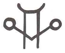

## 🔮 SIGILS — シジル（象徴魔術）(1/3)

---

### ✨ 原文

In the Pop Magic! style, the sigil (sij-i/n) is the first and one of the most effective of all the weapons in the arsenal of any modern magician.  
The sigil technique was reconceptualized and modernized by Austin Osman Spare in the early 20th century and popularized by Chaos Magicians and Thee Temple ov Psychick Youth in the 1980s.  
A sigil is a magically charged symbol like this one:  

The sigil takes a magical desire or intent—let's say "IT IS MY DESIRE TO BE A GREAT ACTOR" (you can, of course, put any desire you want in there)—and folds it down, creating a highly-charged symbol.  
The desire is then forgotten. Only the symbol remains and can then be charged to full potency when the magician chooses.  
Forgetting the desire in its verbal form can be difficult if you've started too ambitiously.  
There's no point charging a sigil to win the lottery if you don't buy a ticket. Start with stuff that's not too emotionally involving.  
I usually sigilize to meet people I'm interested in, or for particular qualities I'll need in a given situation.  
I've also used sigils for healing, for locating lost objects and for mass global change.  
I've been using them for 20 years and they ALWAYS work.  
For me, the period between launching the sigil and its manifestation as a real world event is usually 3 days, 3 weeks or 3 months depending on the variables involved.  
I repeat: sigils ALWAYS work.

---

### 🇯🇵 日本語訳

Pop Magicのスタイルにおいて、シジル（sigil／シジル）は現代魔術師の武器庫における最初にして最も効果的な道具のひとつである。  
この技法は、20世紀初頭にオースティン・オスマン・スペアによって再構築され、1980年代にはカオスマジシャンやThee Temple ov Psychick Youth（TOPY）によって広く普及した。  
シジルとは、魔術的な欲望や意図をこのような記号に変換し、チャージされた象徴である。

例えば「IT IS MY DESIRE TO BE A GREAT ACTOR（私は偉大な俳優になりたい）」という願望を設定し、  
それを折りたたみ、圧縮し、チャージされた象徴的な記号に仕上げる。  
言語としての欲望はその後忘れ去られ、記号のみが残る。そして魔術師が選んだタイミングでフルチャージされるのだ。

欲望の言語的な形を忘れるのは、最初に選んだ目標が大きすぎる場合、特に難しい。  
宝くじに当たりたいなら、まずチケットを買え──それと同じ理屈である。

モリスンは、出会いたい人物との接触や特定の状況で必要となる資質の獲得、癒し、失せ物の発見、さらには世界規模の変化に至るまで、さまざまな目的でシジルを使ってきた。  
20年間にわたり活用してきたが、「シジルは常に効く（ALWAYS work）」と断言している。

願望が現実化するまでの期間は、3日・3週間・3ヶ月のいずれかであることが多いという。

---

### 🐚 注釈（Ravensgate視点）

- この冒頭部分は、Ravensgateでもシジルを基礎的な魔術技術として位置づけていることと完全に一致する。
- 「願望を忘れる」というステップは、ジェイソン・ミラーの“Release of Intent”や、RavensgateにおけるDetonosisの「意図の放出」と通底する。
- 「まずチケットを買え」に象徴されるように、**実践の中で現実的行動を伴う魔術であること**が明言されており、これはミラーの「現実の上に魔術を乗せる」という思想とも一致。
- 願望と結果の間にある「3日・3週・3ヶ月」のスパンは、RavensgateにおいてPDCA的検証サイクルを回すうえでも非常に参考になる指標である。

