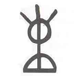

## 🧛 SIGILS — シジル（象徴魔術）(2/3)

---

### 🧛 原文

So. Begin your desire's transformation into pure throbbing symbol in the following fashion:  
First remove the vowels and the repeating letters to leave a string of consonants — TSMYDRBGC.  
Now start squashing the string down, throwing out or combining lines and playing with the letters until only an appropriately witchy-looking glyph is left.  
When you're satisfied it's done, you may wind up with something like this:

Most homemade sigils look a little spooky or alien — like UFO writing or witchy wall-scratchings.  
There are no rules as to how your sigil should look as long as it WORKS for you. RESULTS ONLY are important at this stage.  
If something doesn't work, try something else.  
The point is not to BELIEVE in magic, the point is to DO it and see how it works. This is not religion and blind faith plays no part.

Charging and launching your sigil is the fun part (it's often advisable to make up a bunch of sigils and charge them up later when you've forgotten what they originally represented).  
Now, most of us find it difficult at first to maintain the precise Zen-like concentration necessary to work large-scale magic.  
This concentration can be learned with time and effort but in the meantime, sigils make it easy to sidestep years of training and achieve instant success.

To charge your sigil you must concentrate on its shape, and hold that form in your mind as you evacuate all other thoughts.  
Almost impossible, you might say, but the human body has various mechanisms for inducing brief "no-mind" states.  
Fasting, spinning, intense exhaustion, fear, sex, the fight-or-flight response — all will do the trick.  
I have charged sigils while bungee jumping, lying dying in a hospital bed, experiencing a total solar eclipse and dancing to Techno.  
All of these methods proved to be highly effective but for the eager beginner nothing beats the WANK TECHNIQUE.

---

### 🇯🇵 日本語訳

では、あなたの願望を純粋で脈打つ象徴に変換する工程を始めよう。  
まず、母音と重複する子音を取り除き、残った文字列を得る。例：TSMYDRBGC。  
そこから線を省略したり組み合わせたりして、魔術的で「それっぽい」グリフに変形していく。  
「完成した」と思えた時点で、それはもうあなたのシジルである。

自作のシジルは、たいてい少し不気味だったり、UFOの文字や魔女の壁の落書きのように見えるものだ。  
見た目に「正解」はない。**効けばいい。結果こそがすべてだ。**

もしうまくいかなければ、別の方法を試せばいい。  
魔術を「信じる」ことが目的ではなく、「やってみて効くかどうか」を確かめるのが目的だ。  
これは宗教ではない──盲信は必要ない。

シジルのチャージと発射は、魔術の中でも楽しいプロセスだ。  
多くのシジルを先に作り、内容を忘れた頃にまとめてチャージするのも効果的だ。

大規模な魔術に必要な「禅的集中状態」を保つのは最初は難しい。  
だが、シジルはこの訓練を回避し、即効で結果を出す手段となり得る。

チャージの鍵は、**その図形だけに完全に集中し、他の思考をすべて排除すること**。

それは「ほぼ不可能」に思えるかもしれない。  
だが人間の身体には、短時間だけ無心状態に入る仕組みがいくつも備わっている。

断食、回転、極度の疲労、恐怖、セックス、闘争・逃走反応──どれも有効だ。  
モリスンは、バンジージャンプ、死にかけた病床、皆既日食、テクノで踊る最中にチャージを行ったという。

それらはすべて高い効果を持っていたが──**初心者にとって最強なのは「ワンク・テクニック（自己性愛）」である**。

---

### 🐌 注釈（Ravensgate視点）

- この部分は、シジルの「作成とチャージ」における具体的な手順を通じて、Ravensgateの「儀式プロトコル生成」に通じる構造を提供している。
- 「信じるのではなく試す」「結果のみが重要」という姿勢は、RavensgateのAPI魔術と完全に一致する。
- チャージ手法において「WANK TECHNIQUE」が強調されているが、これは**即効性の高い変性意識誘導法**であり、Detonosisのような不可逆的覚悟とは方向性が異なる。
- 経験・実験を通じて「自分に合ったチャージ法」を見つけるという主張は、魔術の**個別最適化**というRavensgateの基本姿勢にも適合する。

